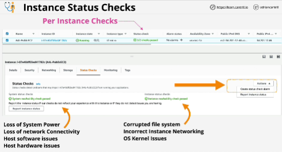

Every instance within EC2 has two high level per instance status checks:
1. **System status check**: failure of system status could indicate one of a few major problems: *the loss of system power, loss of network connectivity, software or hardware issues with the EC2 host* (issues impacting the EC2 service or EC2 host)
2. **Instance status check**: focuses on instances, failure caould indicate things like *corrupt file system, incorrect networking, instance itself*

Handling failures:
- manually: stop and start an instance 
- automatically recover to any system check issues (Auto recovery moves the instance to a new host starts it up with exactly the same configuration as before)

Only work on instances which solely have EBS volumes attached