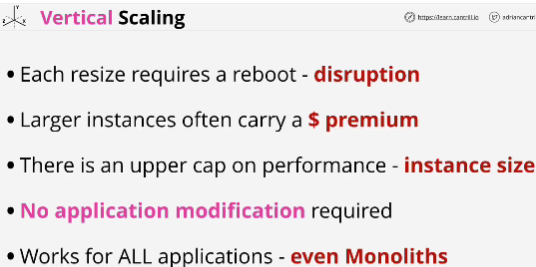
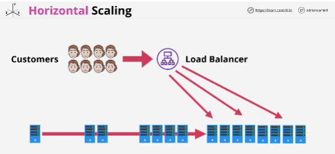
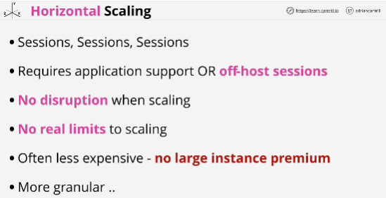
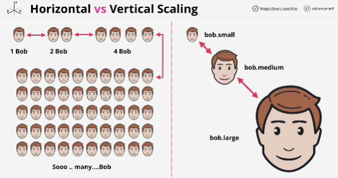

Two different ways that a system can scale to handle increasing, or in some case decreasing load placed on that system. 

**Scaling** is what happens when systems need to grow or shrink in response to increase or decrease of load placed upon them by your customers. 

From technical perspective: adding or removing resources to a system. (system can be a single compute device or tens of thousands or more of individual devices)

**Vertical scaling**: resizing an EC2 instance when you scale
There's downtime: a restart during the resize process, which can potentially cause customer disruption
*Cap* is the maximum instance size

Benefits of Vertical scaling:
- it doesn't need any application modification
- works for all applications even monolithic ones where the whole code base is one single application

**Horizontal scaling** is designed to address some of the issues with vertical scaling.

Instead of increasing the size of an individual instance, horizontal scaling just adds more instances.

Instead of one running copy of your application you might have two or 10 or hundreds of copies each of them running on smaller compute instances. 
They all need to work together, all need to take their share of incoming load placed on the system by customers. 
**Load balancer** is an appliance which sets between your servers, and your customers. When customers attempt to access the system, all that incoming load is distributed across all of the instances running your application. 

- Sessions are everything! (state of your interaction with application is called session)
- With Horizontal scaling you can be shifthing between instances constantly.
- Horizontal scaling can be either application support or off-host sessions.
If you use off-host sessions then your session data is stored in another place, an external database (servers are stateless) - application doesn't care which instance you connect to because your session is externally hosted somewhere else. If application does support it then you get all of the benfits:
    - no disruption while you're scaling (connections can be moved between instances leaving customers unaffected)
    - no real limits to scaling (you're using lots of smaller, more common instances)
- Horizontal scaling is also often less expensive. (you're using smaller commodity instances, not the larger ones which carry a premium)
- It can allow you to be more granular in how you scale (The smaller instance you use the better granularity that you have with horizontal scaling)

