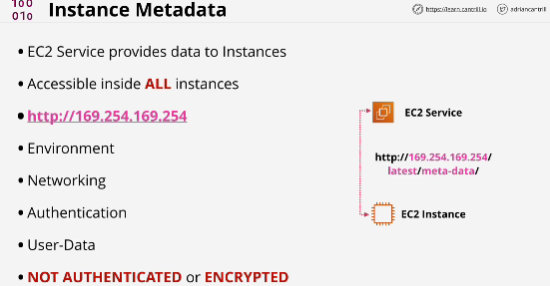

- Service that EC2 provides to instances.
It's data about the instance that can be used to configure or manage a running instance. It's a way the instance or anything running inside the instance can access information about the environment that wouldn't be able to access otherwise. 
- It's accesible inside **ALL** instances using the same access method. 
- **169.254.169.254**
- Metadata allows anything running on the instance to query it for information about that instance, and that information is divided into categories. (host name, security groups)
- Instance metadata can be used by applications to get IPv4 public addressing 
- Can gain access to authentication information.
- Metadata is used by AWS to pass in temporary SSH keys.
- Used to grant access to user data (you can make the instance run scripts to perform automatic configuration steps when you launch an instance)

## EXAM
**METADATA** has no authentication and it's not encrypted.

**Public IPv4 address is not visible inside OS, no exposure for it and it is performed by internet gateway (translate private address into a public address)**

curl http://169.254.169.254/latest/meta-data/public-ipv4 -> query the Metadata service, which is 169.254.169.254 