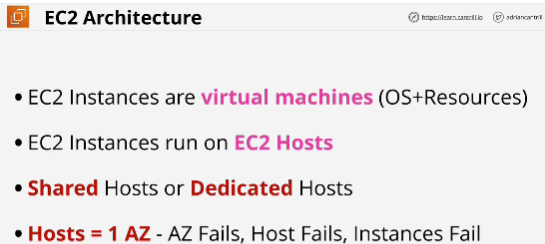
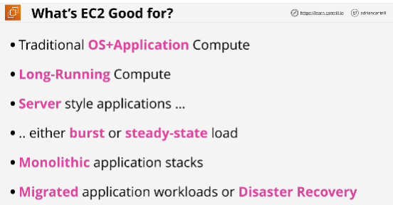

***Shared hosts** are hosts which are shared across different AWS customers. (pay for individual instances based on how long you run them for and what resources they have allocated)
Every customer is isolated when using shared hosts - no visibility for being shared
- Shared hosts are default

**Dedicated host** - pay for entire host not the instances which run on it and not sharing with other AWS customers.

EC2 - AZ resilient service

EC2 hosts have:
- local hardware
- logically CPU 
- memory 
- local storage called **instance store** which is temporary -> two types of networking: storage networking and data networking
- Can connect to the **elastic block store** (runs inside one AZ) EBS lets you allocate volumes (volumes are portions of persistent storage)

Instances stay on host until one of two things happen:
1. Host fails or is taken for maintanacefor some reason by AWS
2. If instance is stopped and then started 
If something of this happens instance will be relocated to another host but in same AZ

**Never do** connect network interfaces or EBS storage located in one AZ to an EC2 instance located in another AZ.

