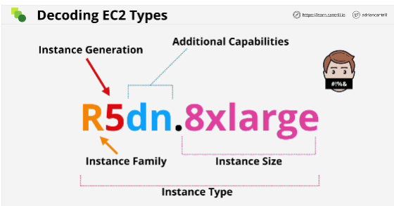
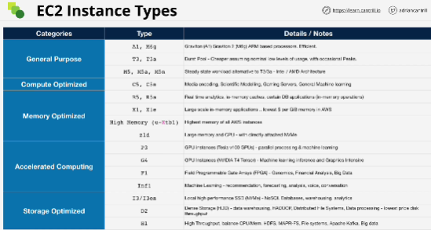

When choosing EC2 instance you're doing so to influence a few different things:
- Raw amount of resources that you get (virtual CPU, memory, local storage capacity, type of storage)
- Reosurce Ratios (some type of instances give more memory)
- Data networking capability that you get. 
- System Architecture / Vendor
- Additional Features and Capabilities

When connecting into instance using EC2 Instance Connect you're using AWS permissions to connect into instance (no need for key pair)

EC2 instances are grouped into five main categories:
- **General Purpose** default: Diverse workloads, equal resource ratio
- **Compute Optimizied**: media processing, HPC, Scientific Modeling, gaming, Machine learning (provide access to the latest high performance CPUs)
- **Memory Optimized**: Porcessing large in-memory datasets, some database workloads (ideal for applications which need to work with large in-memory data sets)
- **Accelerated Computing**: Hardware GPU, field programmable gate arrays (FPGAs) (additional capabilities come into play)
- **Storage Optimized**: Sequential and Random IO - scale-out transactional databases, data warehousing, Elasaticsearch, analytics workloads (large amountt of super-fast local storage)

*Instance restart - keeps the same EC2 host*
*Stop and start instance - moves an instance from one host to another*

Instance family: T, M, I, R

