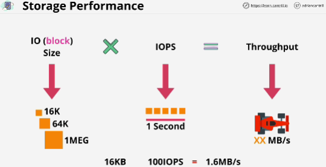

## Key terms
- **Direct** attached: physicals disk which are connected direcctly to a device, laptop or server, in context of EC2 this storage is directly connected to the EC2 hosts (Instance Store), super fast because it's directly attached to hardware but have some problems:
    - if disk fails, the storage can be lost
    - if hardware fails, the storage can be lost
    - If EC2 instance moves between hosts, the storage can be lost
- **Network** attached storage: volumes are created and attached to a device over the network (over the network (EBS))
In on-premises environments, this uses protocols such as an ISCSI, or fiber channel.
In AWS it uses product called Elastic Block Store (EBS) 
    - network storage is highly resilient, and it's seperate from the instance hardware so storage can survive issues
- **Ephemeral** Storage: temporary storage (instance store, physical storage that's attached to an EC2 host)
- **Persistent** Storage: storage which exists as its own thing; it lives on past the lifetime of the device that it's attached to (networrk attached storage deliveres by EBS)

Three main categories of storage available witthin AWS (defines how the storage is presented, and what it can be used for):
1. **Block storage**: create a volume (example inside EBS, volume of block storage has a number of addressable blocks), collection of addressable blocks presented logically, as a volume, or as a blank physical hard drive. Physical storage (hard disks or SSDs)
Block storage has no built-in structure.
With block storaeg in AWS, you can mount a block storage volume (mount EBS volume), and boot off EBS volume.
2. **File storage**: in on-premises provided by file-server (you cannot boot from file storage), can be mounted but it cannot be used for booting
3. **Object storage**: very abstract system where you store objects. There is no structure, it's just a flat collection of objects
*flat storage* it's flat, it doesn't have a structure, you just have a container (S3 in AWS)
Benefits:
    - super scalable
    - it can be accessed by thousands or milions people simultaneously
Not mountable inside a file system, and it's not bootable.

if you want:
- to utilize storage to boot from, *block storage*
- to utilize high performance storage inside an OS *block storage*
- share a file system across multiple different servers or clients or have them accessed by different services, that can be often be *file storage*
- large access to read and write object data at scale *object storage*

## Storage performance
1. IO (block) size: size of the wheels of the car - size of the blocks of data that you're writing to disk
2. IOPS (input-output per second): speed at which the engine of a race car runs at, the revolutions per second - measures the number of IO operations the storage system can support in a second
3. Throughput (amount of data that can be transerred in a given second): end speed of the car - rate of data a storage system can store on a particular piece of storage, either a physical disk or a volume

