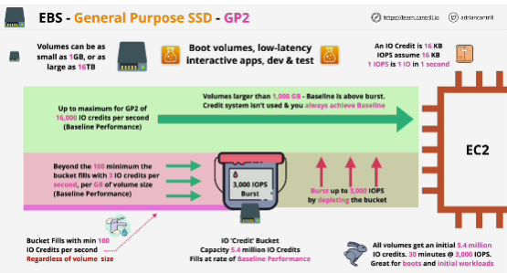

## **General Purposed SSD - GP2** default general purpose SSD based storage provided by EBS. High-performance storage for a fairly low price. 
Every volume has a baseline performance based on its size with a minimum. 

If you're consuming more IO credits than the rate at which your bucket is refiling, then you're depleting bucket.

The maximum IO per second for GP2 is 16 000.

Flexible and good for general usage. 

Great for:
- boot volumes
- low-latency interactive apps
- dev and test environments

## **GP3** is an newer storage type
- SSD based, removes the credit bucket architecture of GP2
- Size starts with standard 3000 IOPS.
- 20% cheaper than GP2.
- Offers a higher max throughput 

Usage scenarios:
- Virtual desktops
- Medium-sized databases
- Low-latency applications
- Dev and testing environments
- Boot volumes

Annything above 3000 IOPS performance doesn't get added automatically like GP2, which scales on size
