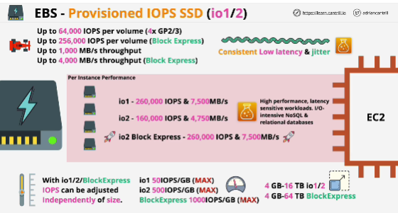

Three types of provisioned OPS SSD:
- General release:
1. io1
2. io2
Preview:
3. io2 Block Express

IOPs are configurable independent of the size ot the volume, and they're designed for super high performance situations where lower latency and consistency of that lower latency are both important characteristics.

With io1 and io2 can be achieved maximum of 64 000 IOPS per volume, and 1 000 MB/s of throughput, volume size: 4 GB - 16 TB

With io2 Block Express can achieve 256 000 IOPS per volume, and 4 000 MB/s of throughput, volume size: up to 64 GB

## Per instance performance: there is a maximum performance which can be achieved between EBS service and a single EC2 instance. This is influenced by three things:
    - type of volumes
    - type of instance
    - size of the instance

Provision IOPS SSD is going to be used for anything which needs low latency or sub-millisecond latency, consistent latency, and higher levels of performance

