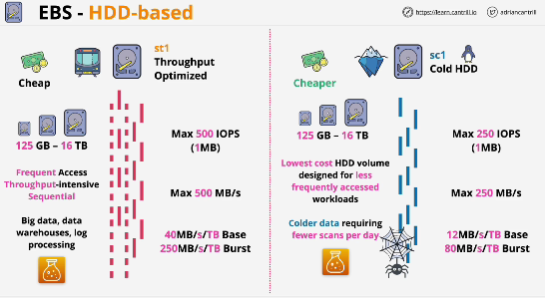

HDD-based means they have moving bits.

Three types of HDD-based, two are in general usage:
1. **st1** which is throughput optimized HDD, fast hard drive, cheap
    - desinged for data which needs to be written or read in a fairly sequential way.
    - volume range 125 GB - 16 TB size
    - maximum 500 IOPS
    - *IO on HDD-based volumes is measured as 1 MB blocks*
    - designed for when cost is a concern (big data, data warehouses and log processing)

2. **sc1** which has cold HDD, cheaper then st1
    - designed for in frequent workloads
    - maximum 250 IOPS
    - volumes can range 125 GB - 16 TB size
    - the lowest cost EBS storage available
    - designed for less frequently accessed workloads
    - designed for when you need a economy of data storage
    - for anything which isn't day-to-day accessed

