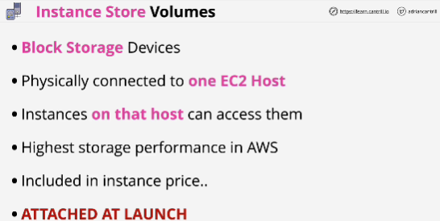
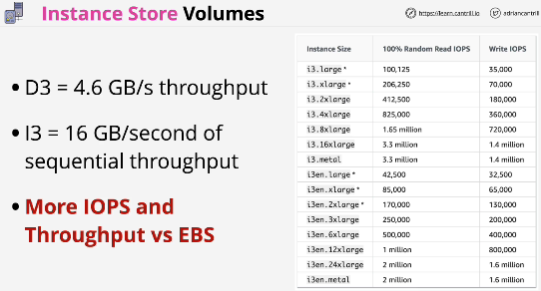

Each EC2 host has its own instance store volumes and they're isolated to that one particular host.

**You have to attach them at launch time, and unlike EBS you can't attach them afterwards.**

If an instances moves between hosts then any data that was present on the instance store volumes is lost.

When instances move between hosts they're given new blank ephemeral volumes, data on the old volumes is lost. 

If a physical volume fails, then instance two would lose whatever data was on that volume. 

One of the primary benefits of instance store volumes is **performance** - can achieve much higher levels of throughput and more IOPS by using instance store volumes vs EBS.

D3 instance - storage optimized

## EXAM
- Instance store volumes are local to an EC2 host
- Can only add instant store volumes to an instance at launch time. 
- Any data on instance store volumes is lost if that instance moves between hosts
- Provide high performance: it's the highest data performance that you can achieve within AWS. 
- You pay for it anyway
- Instance store volumes are **temporary**: cannot use them for data that you rely on or data which is not replaceable - not for persistent storage of data. 