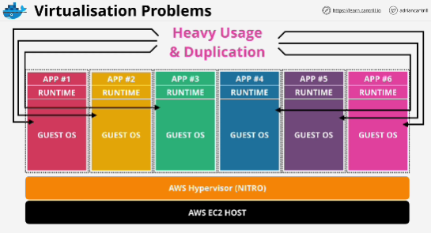
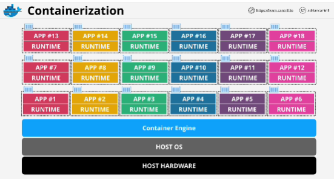
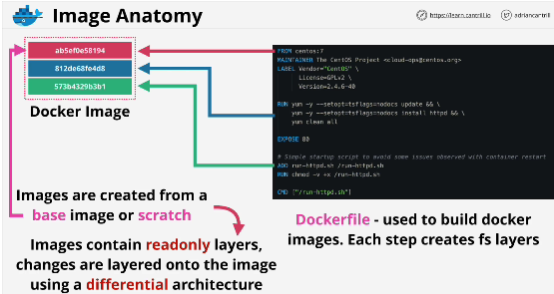
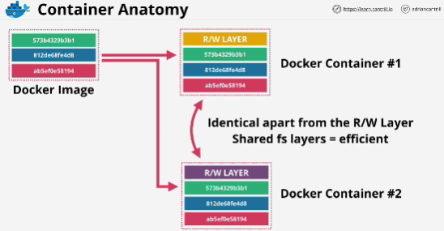
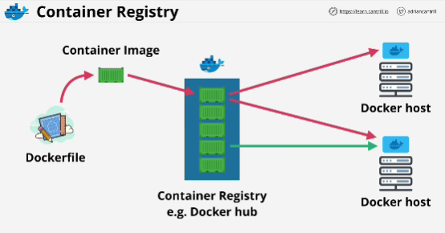
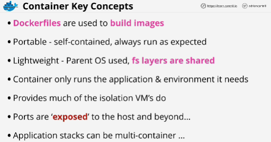

**Virtualization**
- process of running multiple OS on the same physical hardware
- each of virtual machines is an OS with associated resources
- with virtual machines OS consumes a lot of system resources

**Containerization**
- instead of virtualization, OS running on hardware
- container runs as a process within the OS (it's isolated from all of the other processes but it can use the host OS)
- ability to run more applications on a single piece of hardware is one of the many benefits of containers

- Container is a running copy of a Docker Image (they're made up of multiple independent layers)

- Each line in a Dockerfile is processed one by one and each line creates a new file system layer inside the Docker image that creates it. 

- In Docker, the system layers that make up a Docker image are normally read only.

- A docker image is how we create a docker container.
- A docker container is just a running copy of a Docker Image with one difference - docker container has an additional read-write file system layer
- Each layer is differential and it stores only the changes made against it verus the layers below. 

Container registry - Docker Hub

**Container Registry**
- It's a registry or a hub of container images.
*Docker container is one type of container.*
*Docker host is one type of container host.*
*Docker Hub is a type of container hub or a type of container registry operated by the company Docker.*

**Container key concepts**
- Portability and consistency are two of the main benefits of using containerized computing. 
- Layers used within images can be shared and images can be based off other images. Layer are read-only and an image is collection of layers group together, ehich can be shared and reused. 
- Containers use very little memory and they are super fast to start and stop.
- Containers are isolated and anything running in them needs to be exposed to the outside world. 
- Some more complex application stacks can consist of multiple containers. 

