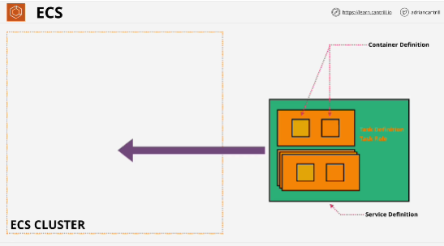
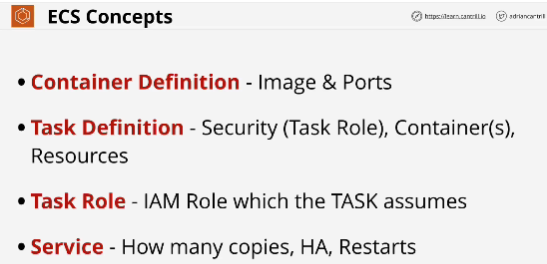

- Product which allows using containers running on infrastructure which AWS fully manage or partially manage. 
- ECS is to containers what EC2 is to virtual machines
- ECS uses, clusters, which run in one of two modes:
1. EC2 mode which uses EC2 instances as container hosts, and yo can see these inside your account.
2. Fargate mode is serverless way of running docker containers where AWS manage the container host part and just leave you to define an architect to your environment using containers.

- ECS is a service that accepts containers and some instructions that you provide and it orchestrates where and how to run those containers.
It's a managed container based compute service
- ECS lets you create a cluster.
- Clusters are where your containers run from. 
- To tell ECS about your container images, you create what's known as a **container definition**. 
- Container definition tells ECS where your container image is. (pointer to where the container is stored and what port is exposed, the rest is defined in the task definition)
- **Task definition** represents a self-contained application. A task could have one container definied inside it or many. 
A task in ECS represents the application as a whole and it stores whatever container definitions are used to make up that one single application. 
Task definition store the resources used by the task. (CPU and memory) it also stores **task role**: an IAM role that a task can assume

## EXAM
- Taks roles are the best practice way of giving containers within ECS permissions to access AWS products and services.

Task and containers are seperate things. A task can include one or more containers. 

**ECS service** (configuring via service definition)
- **Service definition** defines a service (service is how for ECS we can define how we want a task to scale, how many copies we'd like to run)

You create a cluster and then you deploy tasks or services into that cluster. 

## ECS Concepts
**Container definition**: this defines image and the ports that will be used for a container.
**Task definition**: applies to the application as a whole, it can be a single container. It's also the task definition where you specify the task role. 
**Task role**: assumed by anything that's inside the task.
**Service**: this is how you can define how many copies of a task you want to run. (scaling, high availability)

