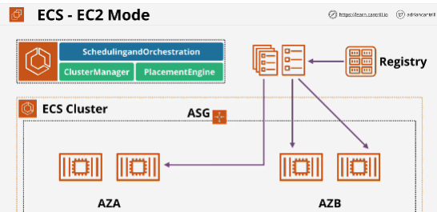
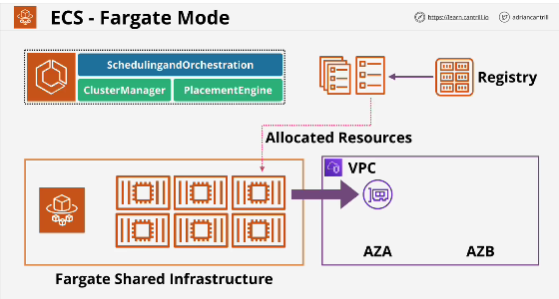
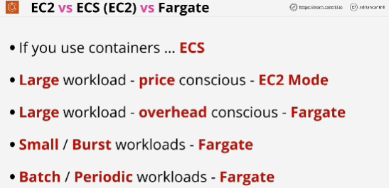

## EC2 Mode
- ECS management components(handle high-level) tasks like scheduling orchestration, cluster management and the placement engine which handles where to run containers so which container hosts. These high-level components exist in both modes: EC2 mode and Fargate mode.
- With EC2 mode an ECS cluster is created within a VPC inside your AWS account. It benefits from the multiple AZs which are available within VPC. 
- EC2 uses container registries and these are where your container images are stored. 
- Container instances are not something that's deliveres as a managed service - they're just EC2 instances. 

## Fargate mode
- You don't have to manage EC2 instances for use as container hosts. 
- Fargate is cluster model which means you have no servers to manage - you're not paying for EC2 instances regardless of whether you're using them or not.
- What differs is how containers are actually hosted.
- AWS maintain a shared Fargate infrastructure platform.
- You gain access to resources from a shared pool, just like you can run EC2 instances on shared hardware, but you have no visibility of other customers.
- Resources are allocated to the shared Fargate platform.
- Each of the tasks is injected into the VPC, and it gets given an elastic network interface.
- Tasks and services are running from the shared infrastructure platfrom and then they're injected into your VPC.
- If the VPC is configure to use public subnets which automatically allocate an IPv4 address, then tasks and services can be given public IPv4 addressing.
- With Fargate mode, you only pay for the containers that you're using based on the resources that they consume. (no host costs, no need to manage hosts, provision hosts or think about capacity and availability)

## EC2 vs ECS (EC2) vs Fargate
Three main options:
1. Using EC2 natively for an application, so deploying an application as a virtual machine. 
2. Using ECS in EC2 mode, using containerized application, but running in ECS using an EC2-based cluster.
3. Using containerized application running in ECS but in Fargate mode.

## EC2 vs ECS
- If you use containers, pick ECS. 
- If you're wanting to just quickly test containers, you can use EC2 as a docker host, but for production usage, it's almost never good idea to do that. 
- Containers make sense if you're just wanting to isolate your applications. (app which have: low level usage, all use the same OS, whre you don't need overhead or virtualization)
- Pick EC2 mode when you have a large workload and your business is price conscious. 
- Large, consistent workload, if you're heavily using containers, but if you're a price-conscious organization, pick EC2 mode.
- Overhead-conscious, even with large workloads, pick Fargate
- Minimizing management overhead, pick Fargate
- Batch / Periodic workloads: you pay for what you consume - Fargate

