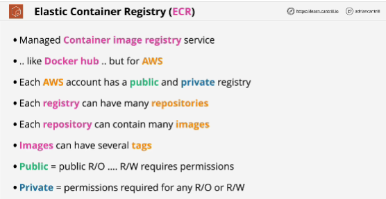

- It's a managed container image registry service, like Docker hub but fro AWS.
- AWS provide which hosts and manages container images.
- Within ECR product we have **public** and **private** registries and each AWS account is provided with one of each.
- Inside each registry you can have many repositories.
- Inside each repository you can have many container images, and container images can have several tags, and these tags need to be unique within your repository.

- Public registries means that anyone can have read-only access to anything within that registry, but read-write requires permissions. 
- Private registry means that permissions are required for any read or any read-write operations. With a public registry, anyone can pull, but to push you need permissions, and for private registry permissions are required for any operations. 

## Benfits of ECR
- It's integrated with IAM
- ECR offers security scanning on images, and this comes in two different flavors, **basic** and **enhanced**
- Real time metrics inside CloudWatch
- ECR logs all API actions into CloudTrail and then also it generates events which are delivered into **EventBridge**
- ECR offers replication of container images, and this is both cross-region and cross-account

