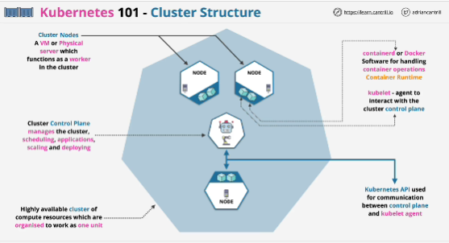
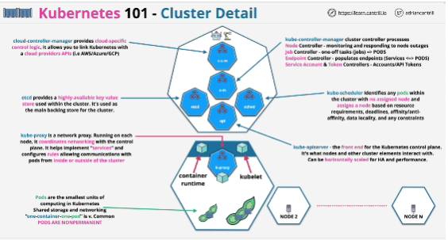
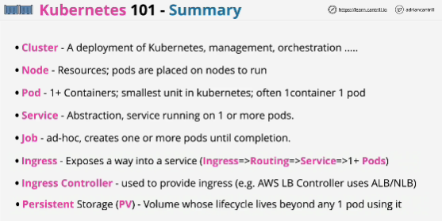

- Open-source container orchestration system for automating deployment, scaling, and management of containerized applications.
- Kubernetes lets you run containers in a reliable and scalable way, making efficient use of resources and lets you expose your containerized applications to the outside world or your business. 
- Cloud agnostic product: you can use it on premises and within many public cloud platforms.

- **Cluster** in KUbernetes is a highly available cluster of compute resources and these are organized to work as one unit.
- The cluster starts with **the cluster control plane** which is the part which manages the cluster.
- Compute within a Kubernetes cluster is provided via nodes (virtual or physical servers which function as a worker within the cluster)
- Running on each of the nodes is software and at minimum, this is **containerd** or another container run time, which is the software used to handle your container operations.
- **Kubelet** which is an agent to interact with the cluster control plane. They communicate with the cluster control plane using the Kubernetes API.

**Pods** are the smallest unit of computing within Kubernetes. You can have pods which have multiple containers and provide shared storage and networking for those pods. 

- The pods handle the containers within them.

- Pods can be deleted when finished, evicted for lack of resources, or if the node itself fails.

- They aren't permanent and aren't designed to be viewed as highly available entities.

What runs on control plane?
1. API known as **kube-apiserver** (front-end for control plane, it can be scaled horizontally for performance and to ensure the high availability)
2. **etcd**: provides highly-available key value store. 
3. **kube-scheduler**: responsible for constantly checking for any pods within the cluster, which don't have a node assigned
4. **cloud-controller-manager**: this is what allows Kubernetes to integrate with any cloud providers
5. **kube-controller-manager**: collection of processes
6. **kube-proxy - K proxy**: runs on every node and coordinates networking with the cluster control plane. It helps implement services and configures rules, allowing the communications with pods, from inside or outside of the cluster.

**It's best to architect things within Kubernetes to be stateless from a pod perspective**
Any storage in Kubernetes is by default **ephemeral** provided locally by a node. 
If a pod moves between nodes, then that storage is lost. 

