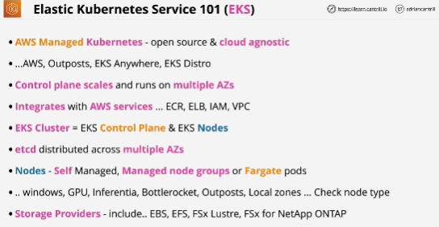
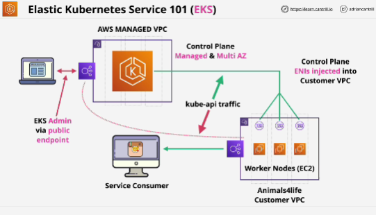

**Amazon Elastic Kubernetes Service (Amazon EKS)** is a fully-managed, Kubernetes implementation that simplifies the process of building, securing, operating, and maintaining Kubernetes clusters on AWS.

EKS can be run in different ways:
- it can be run on AWS itself
- it can be run on AWS Outposts
- it can run using EKS anywhere which allows you to create EKS clusters on premises or anywhere else

EKS product as open source via the EKS Distro

Kubernetes control plane is managed by AWS and scales based on load and also runs across multiple AZs.

Different ways how nodes can be handled:
- do self-managed nodes running in a group
- managed node groups, which are still EC2, but this is where the product handles the provisioning and life cycle management
- run pods on Fargate

