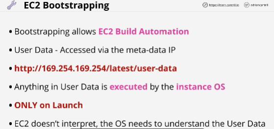
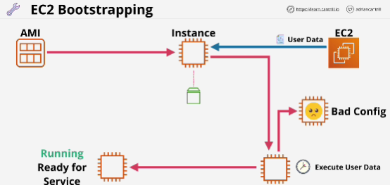
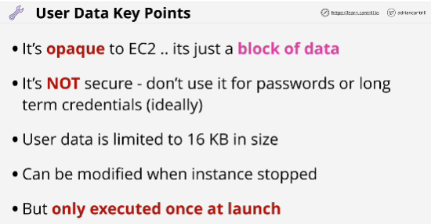
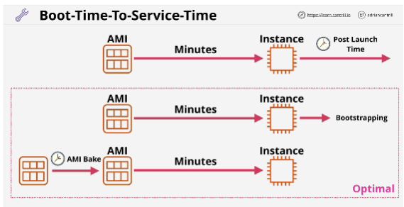

**Bootsrapping** is a process where scripts or other bits of configuration can be run when an instance is first launched, meaning that the instance can be brought into service in a certain pre-configured state.

Bootsrapping is a process which exists outside EC2.
 
In systems automation, bootsrapping is a process, which allows a system to self-configure or perform some self-configuration steps.

In EC2, it allows for build automation. (some steps which can occur when you launch an instance to bring that instance into a configured state) 
It allows you to direct an EC2 instance to do something when launched. (perform some software installations and some post-installation configuration)

With EC2, bootsrapping is enabled using EC2 user data.
User data is a piece of information that you can pass into and EC2 instance. 

Anything in User Data is executed by the instance OS. (**it's executed only once at launch time**)

If you update user data and restart an instance, it's not executed again. 
User data applies only to the first initial launch of the instance.

**EC2 as a service doesn't validate user data.**

AMI is used to launch an EC2 instance and this creates an EBS volume, which is attached to the EC2 instance. 
If it sees any user data, then it executes on launch of that instance.

User data is treated like any other script that the OS runs. It needs to be valid and at the end of running the script, the EC2 instance will either be in a running state and ready for service, meaning that the instance has finished its startup process, and it was successful and the instance is in a functional and running state.

- User data is not **secure** - anyone who can access the instance OS can access the user data.
- User data is limited to 16KB size.
- User data can be modified.

## EXAM
How quickly you can bring an instance into service?
- Metric, boot-time-to-service-time

How quickly after you launch an instance is it ready for service?
- This includes the time that AWS require to provision the EC2 instance and the time taken for any software updates, installations or configurations to take place within the OS. 
That time can be measured in minutes. (from launch time to service time)

Post launch time: time reqiured after launch for you to perform manual configuration or automatic configuration before the instance is ready for service. 

AMI baking: doing it in advance and creating an AMI with all of that work baked in (this removes the post launch time)

Reduce launch time: AMI baking + bootstrapping

