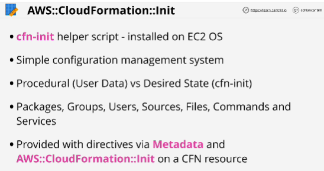
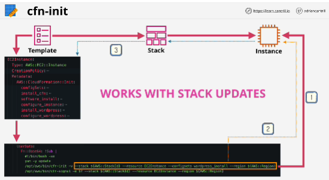
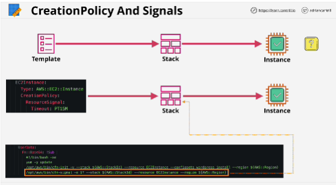

CloudFormation::Init is a way that you can pass complex bootstrapping instructions into an EC2 instance.

**cfn-init** helper script - installed on EC2 OS
cfn-init can be **procedural** (it can be used to run commands just like user data) or **desired state** (where you direct it how you want something to be)

**Creation policy** is something which is added to a logical resource inside a CloudFormation template. 
ClouFormation waits for a signal from the resource itself.

cfn-signal is reporting to CloudFormation the success or not of the cfn-init bootstrapping and this is reported to the CloudFormation stack. 

