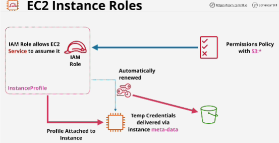
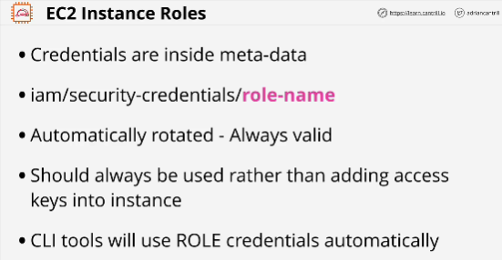

Allowing a service to assume a role grants a service the permissions that that role has.

EC2 instance roles are roles that an instance can assume, and anything running in that instance has the permissions that role grants.

Credentials available inside the metadata, they're always valid.

- Credentials are delivered via the instance metadata. 
- Roles are alwasy perferable than storing long-term credentials, so access keys into an EC2 instance.

You just need to create an instance role and then attach it to an instance and once you do, that instance is capable of assuming that role, gaining access to temporary credentials and then any applications installed on that instance, including the command line utilities, are capable of interacting with AWS using those credentials.

