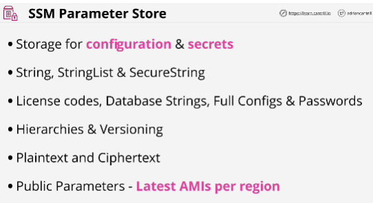
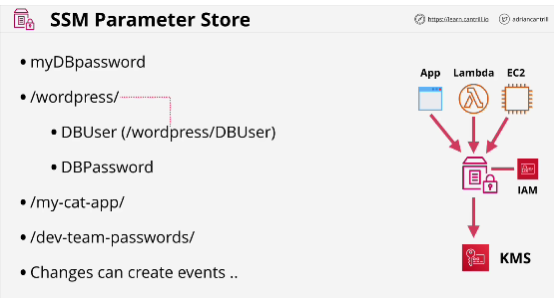

**Parameter store** lets you create parameters (parameter name and parameter value)
Value is a part that stores the actual configuration.

- Parameter store offers to store three type of parameters:
1. Strings
2. StringList
3. Secure strings

You can store: License codes, Database strings, Full Configs & Passwords

- Offers to store parameters using a hierarchical structure and different versions of parameters.

- Parameter store also plaint text and parameters (good for things like: DB connection strings or DB users) and Ciphertext (to allow encrypt parameters)

SSM Parameter Store -> public service

- Permissions that interact with the parameter store are seperate than the permissions to interact with KMS.
