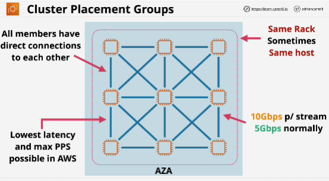
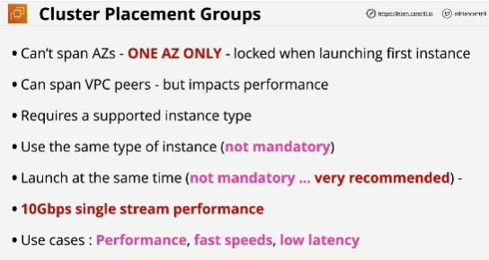
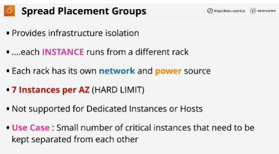
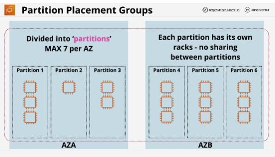
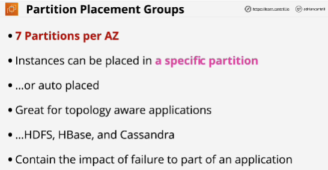

Three groups:
1. **Cluster** placement groups are designed to ensure that any instances in a single cluster placement group are physically close together.
2. **Spread** placement groups which are the inverse ensuring that instances are all using differnet underlying hardware.
3. **Partition** placement groups designed for distributed and replicated applications which have infrastructure awareness.

## Cluster placement groups
- Used when you want to achieve the absolute high level of performance possible within EC2.
- Best practice: launch all of the instances which will be in the group all at the same time. 
- This ensures that AWS allocate capacity for everything you require.
- When you create placement group you don't specify an AZ, instead when you launch the first instance or instances into that placement group, it will lock that placement group to whichever AZ that instance is also launched into.
- Use same rack, often the same EC2 host.

- **Cluster placement groups are used when you really need performance that needed to achieve the highest levels of throughput and the lowest consistent latencied within AWS but the trade off is because of the physical location. If the hardware that they're running on fails logically it could take down all of the instances within that cluster placement group.**

Cluster placement groups are not supported on ever type of instance. 
You should use the same type of instance to get better results though this is not mandatory.

## Spread placement groups
- Designed to ensure the maximum amount of availability and resilience for an application. 
- Can span multiple AZs
- Instances which are placed into a spread placement group are located on seperate isolated infrastructure racks within each AZ.
- So each instance has its own isolated networking and power supply seperate from any of the other instances also within that same spread placement group.
- Limit: 7 instances per AZ
- You're guaranteed that every instance launched into a spread placement group will be entirely seperated from every other instance that's also in that spread placement group.

- **Spread placement groups are used when you have a small number of critical instances that need to be kept seperated from each other.** (mirrors of a file server or different domain controllers within an organization)

If one fails, there is a small chance as possible that any of the other instances will fail.

## Partition placement groups
- Designed for when you have infrastructure where you have more than seven instances per AZ but you still need the ability to seperate those instances into seperate fault domains.
- Can be created across multiple AZs in a region. 
- When creating, you sepcify a number of partitions with a maximumm of seven per AZ in that region.
- Each partition inside group has its own racks with isolated power and networking.
- There is a guarantee of no sharing of infrastucture between those partitions.
- Each partition is isolated but you get to control which partition to launch instances into.
- Partition placement groups are designed for huge scale parallel processing systems where you need to create groupings of instances and have them separated. 
- You as a designer of a system can have control over which instances are in the same and different partitions.
- Partition placement groups offer visibility into the partitions. You can see which instances are in which partitions.

