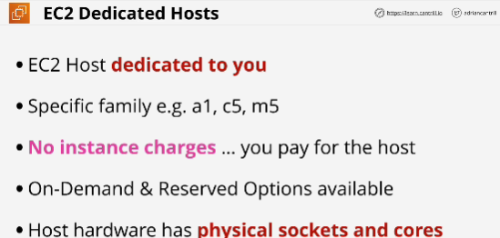
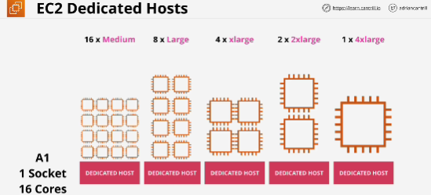
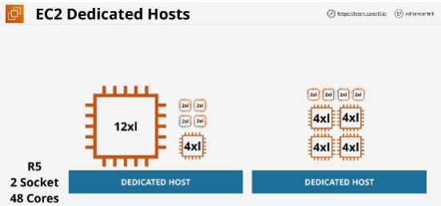
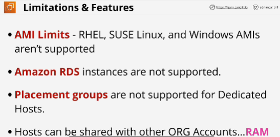

- EC2 host which is allocated to you in its entirety.
- Pay for host itself which is designed for a spwcific family of instances.
- No charges for instances 
- Host hardware has physical sockets and cores for two reasons:
1. It dictates how many instances can be run on that host.
2. Software which is licensed based on physical sockets or cores can utilize this visibility of the hardware.

- With nitro-based dedicated hosts there's a lot more flexibility allowing a business to maximize the value of that host.

## Limitations & Features
- AMI limits 

