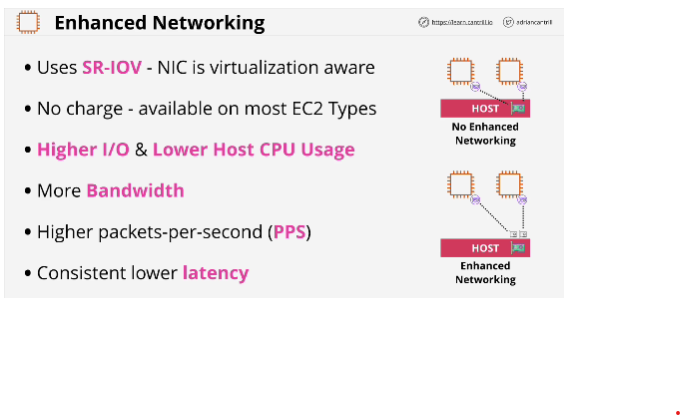
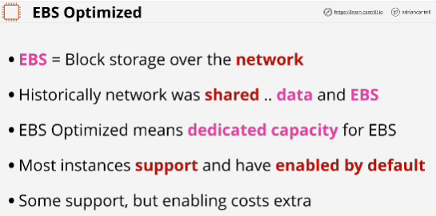

**Enhanced networking** is a feature which is designed to improve the overall performance of EC2 networking. It's required for any high-end performance features such as cluster placement groups. 
- Host has network interface cards, which are aware of virtualization. 

**EBS Optimized**: some stack optimizations have taken place and dedicated capacity has been provided for the instance for EBS's usage. 
It means that faster speeds are possible with EBS and the storage side of things doesn't impact the data performance. 
It's supported and enabled by default at no extra charge.

