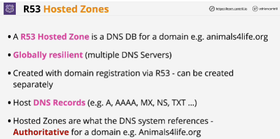
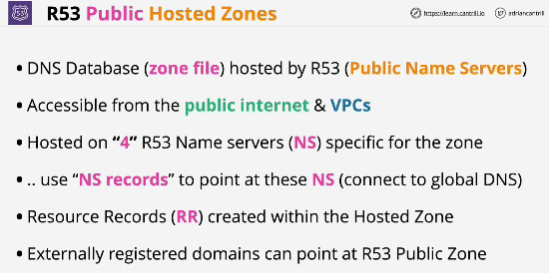
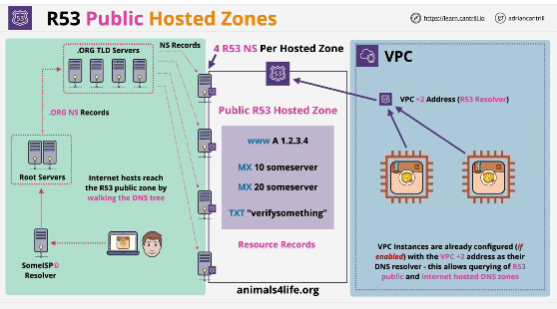

- A hosted zone is DNS database for a given section of the global DNS database specigically for a domain.
- Route 53 is a globally resilient service.
- A zone, whether public or private, hosts DNS records.

- Inside a public hosted zone, you create resource records, which are the actual items of data, which DNS uses.

