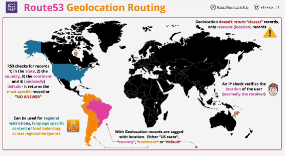

- Similar to latency routing only instead of latency the location of customers and the location of resources are used to influence resolution decisions.

- When you create records you tag the records with the location. Location is generally country.

- We have the location of the user and we have the location of the records.

# **Geolocation doesn't return the closest record. It only returns relevant records.**

- Checking for matching records: 
1. if user is based in US: 
    - checks the state of the user
    - checks the country of the user
    - checks the continent of the user
    - default record: if defined, returned if no record is relevant for that user 
    - if nothing matches - no answer is returned

- Geolocation is ideal if you want to **restrict content**, for example providing content for the US market, only (you can create USA record and only people located in the US will recive that record as a response for any queries)
- Use this type to provide **language specific content** or to load balance across regional endpoints based on customer location.

- Smallest type of record **subdivision** (US state), country, continent, default record (optionally)

- You only have records returned if the location is relevant. 

