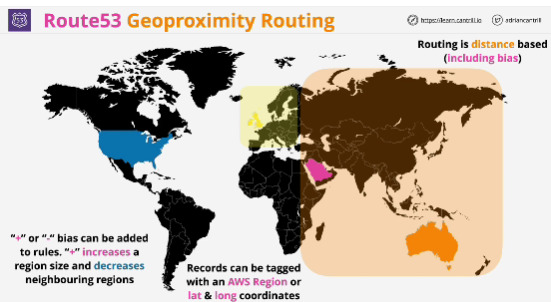

- Aims to provide records which are as close to your customers as possible. 

- Aims to calculate the distance between the customer and the record and answer with the lowest distance.

- This routing policy works on distance and provides few key benefits:

- You define the region that a resource is created in it it's an AWS resource or provide the latitude and longitude coordinates, if it's an external resource.
- You also define *bias* (rather than using the actual physical distance, we can adjust how Route 53 handles the calculation)

- Geoproximity lets Route 53 route traffic to your resources based on the geographic location of your users and your resources, but you can optionally chose to route more traffic or less traffic to a given resource by specifying a value. 

- A **bias** expands or shrinks the size of a geographic region that is used for traffic to be routed to.

