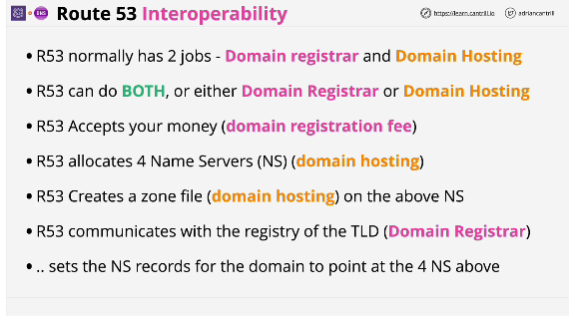
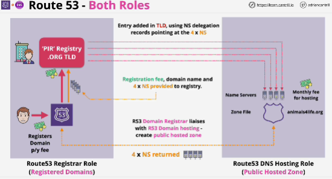
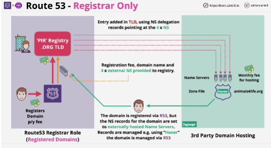
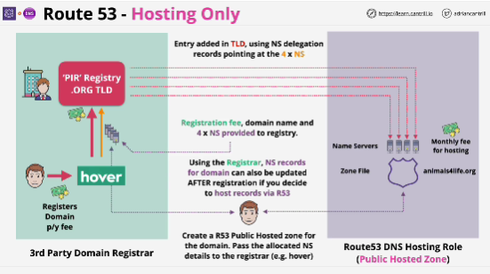

**Route 53**
- Has 2 jobs:
1. Domain registrar
2. Domain hosting
- Allocates 4 Route 53 DNS servers called name servers.
- Creates a zone file (hosts on 4 name servers)

- **Registrar** company who registers the domain on your behalf and the domain hosting, which is how you add a manage records within hosted zones.

Tradtitional architecture where you register and host a domain using Route 53. 

## Registrar only
- Different entity is hosting the domain.
- With this architecture you're not actually using Route 53 for domain hosting and domain hosting is the part of Route 53, which adds most of the value.
- This is the worst way to manage domains.

## Hosting only
- The domain is registered via a third party domain registrar.
- You can use this architecture either while registering a domain or after the fact by creating the public hosted zone and then updating the name server records in the domain via the third party registrar, and then .org registry.

