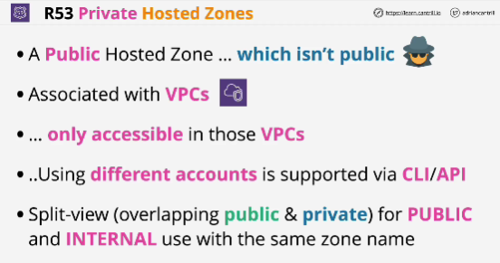
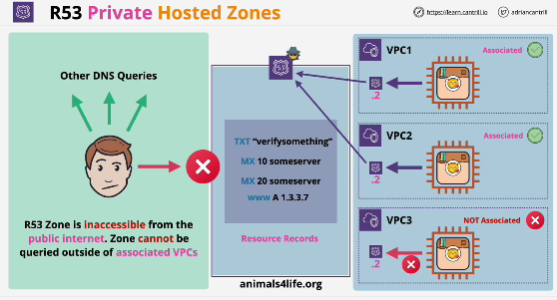
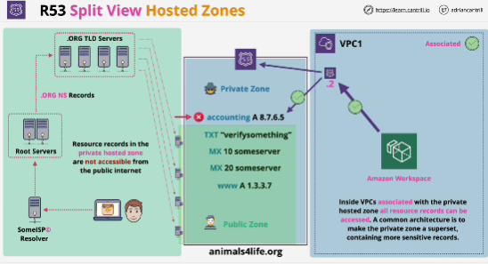

- It's associated with VPCs within AWS and it's only accessible within VPCs that it's associated with.
- **Split-view/split-horizon DNS**: technique where you have public and private hosted zones of the same name, meaning that you can have a different variant of zone for private users vs public.

- Private hosted zone is inaccessible from the public internet. It can be made accessible though from VPCs. 
- To be able to access a private hosted zone, the service needs to be running inside a VPC and that VPC needs to be assoiciated with the private hosted zone.

