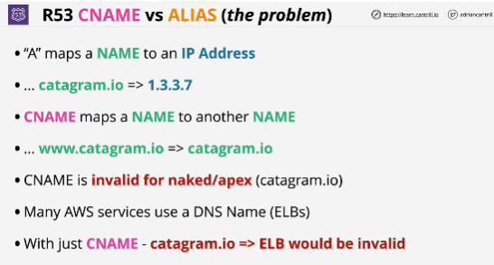
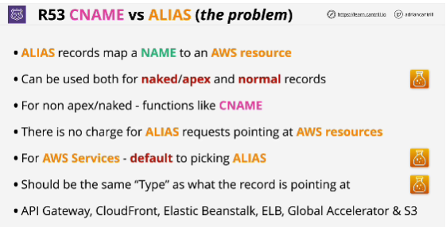

- A CNAME maps a name to another name.
- It's a way to create another alternative name for something within DNS.
- You can't use a CNAME for the apex of a domain, also known as the naked domain.

- **Alias records** can be used for both the naked domain known as the domain Apex or the normal records. 

## EXAM
- Default to picking *alias records* for anything in a domain where you're pointing at AWS resources. 
- Alias is a subtype. You can have an A record alias and a CNAME record alias. Both of them are alias records but you need to match the record type with the type of the record you're pointing at. 

- You're going to use alias records when you're pointing at AWS services such as the API Gateway, Cloudfront, Elastic Beanstalk..

- The alias is a type of record that's been implemented by AWS and it's outside of the usual DNS standard so it's something that use only route 53 is hosting your domains.

