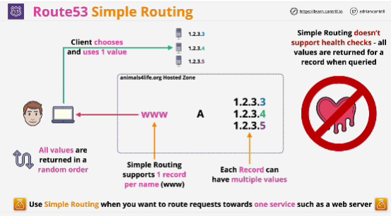

- Default routing policies

- With simple routing, you can create one record per name.

- Each record using simple routing can have multiple values, which are part of that same record.

- You should use it when you want to route requests towards one single service.

- Limitation: **It doesn't support health checks**

- With simple routing there are no checks that the resource being pointed out by the record is actually operational.

