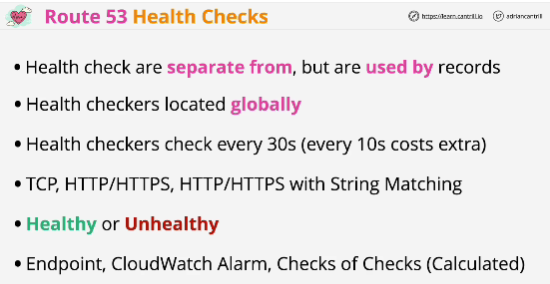
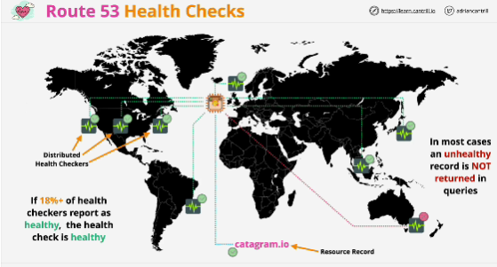

- Health checks are seperate from, but are used by records inside Route 53.

- You don't create the checks within records. Health checks exist separately.

- You can check anything which is accessible over the public internet. It just needs an IP address.

- The checks occur every 30s by default.

- Types of TCP checks:
    - TCP checks -> needs to be successful within 10 seconds
    - HTTP checks -> must be able to establish a TCP connection with the endpoint within 4 seconds
    - HTTP and HTTPS checks -> you can perform string matches;

- Based on these health checks, an endpoint is either **healthy or unhealthy.**

- Checks can be one of three types:
1. **Endpoint checks**: asses the health of an actual edpoint that you specify
2. **CloudWatch alarm checks**: react to CloudWatch alarms which can be configured separetely
3. **Calculator checks**: checks of other checks

