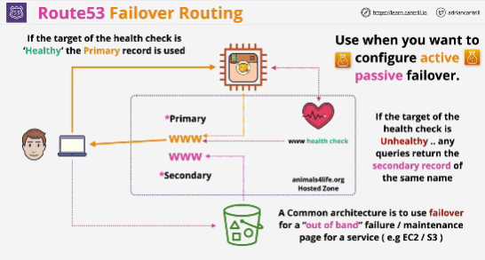

- With failover we can add multiple records of the same name; a primary and secondary

- Key element of failover routing is the inclusion of a health check. 

- The health check generally occurs on the primary record.

- If primary record is healthy that any queries reoslve to the value of the primary record.

- If the primary record fails it's health check, then the secondary vaule of the same name is returned.

- Use this when you need to configure active passive failover where you want to route traffic to a resource when that resource is healthy, or to a different resource, when the original resource is failing its health check.

