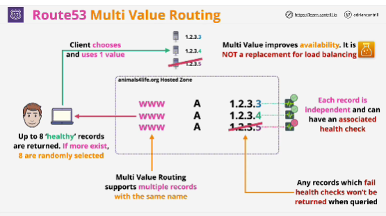

- Multi value routing is mixture between simple and fail-over, taking the benefits of each and merging them into one routing policy.

- We start with a hosted zone, and you can create many records all with the same name. 

- Each of the records when using this routing type can have an associated health check. When queired, up to 8 healthy records are returned to the client.

- Multi value routing aims to improve availability by allowing a more active, active approach to DNS.

- Simple routing has no health checks and is generally used for a single resource such as a web server.
- Fail-over is used for active backup architectures, commonly with an S3 bucket as a backup. 
- Multi value is used when you have many resources which can all service requests and you want them all health checked and then returned at radnom.

