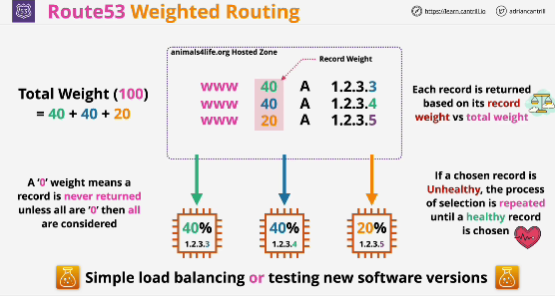

- Can be used when you're looking for a simple form of load balancing, or when you want to test new versions of software.

- You're able to specify a weight for each record.

- Setting a weight record to zero means that it's never returned.

- Helath checks don't remove records from the calculation and don't adjust the total weight.

- If an unhealthy record is selected to be returned, it's just skipped over and the process repeats until a healthy record is selected. 

- Great for very simple load balancing or when you want to test new software versions. 

- Weighted routing is useful when you have a group of records with the same name and want to control the distribution so the amount of the time that each of them is returned in response to queries.

