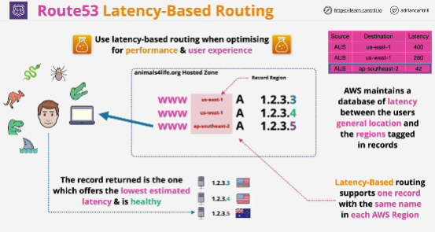

- Should be used when you're trying to optimize for performance and user experience, when you want Route 53 to return records which can provide better performance.

- For each of the records, you can specify a record region.

- Support one record with the same name for each AWS region.

- Idea is that you're specifying the region where the infrastructure for that record is located.

- AWS maintains a database of latencies between different regions of the world.

- Latency-based routing can be combined with health checks. If record is unhealthy, then the next lowest latency is returned to the client making the resolution request.

- This type of routing is designed to improve performance for global applications by directing traffic towards infrastructure with the best, lowest latency, for users accessing that application.

- Database which AWS maintain isn't real time. It's updated in background and doesn't really account for any local networking issues.

