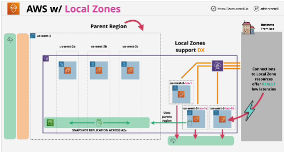
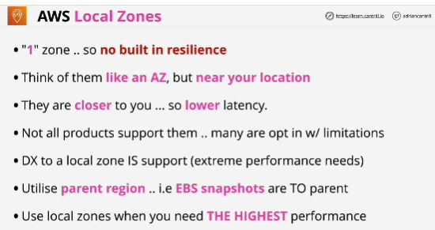

- **AWS Local Zones** are a type of infrastructure deployment that places compute, storage, database, and other select AWS services close to large population and industry centers.

- Different services support Local Zones in different ways.

- Some things within the Local Zones still utilize the Parent Region.

- Local zones have private networking with the Parent Region.

- Certain thing occur within the Local zone but certain things rely on the Parent region (example EBS snapshots).

- One zone runs in one specific facility.

